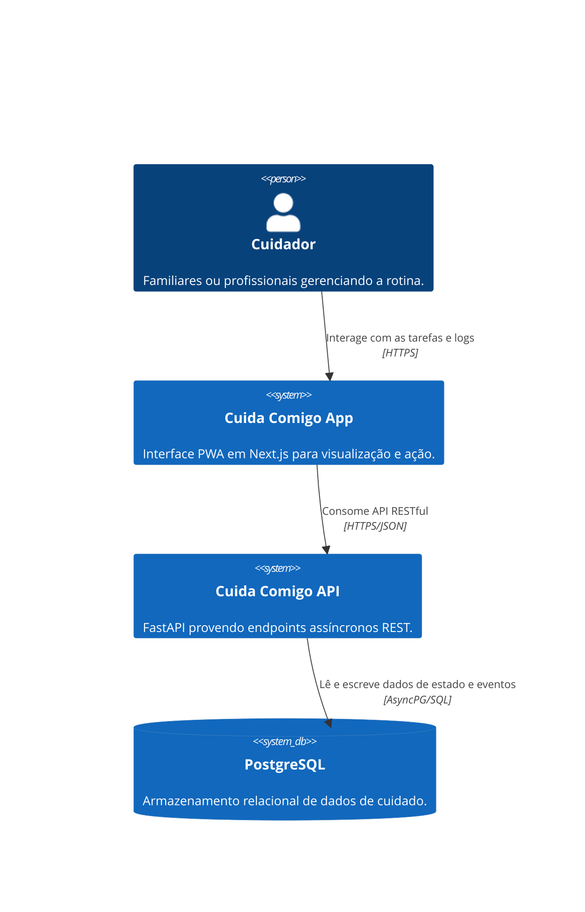

# Arquitetura do Cuida Comigo (v0.1-Alpha)

> Este documento descreve as decisões arquiteturais e o modelo de domínio principal da aplicação, consolidado conforme as especificações do Tech Spec.

## Decisão de Frameworks e Componentes
- **Frontend (Cliente):** React / Next.js focado em renderização híbrida e suporte futuro para PWA (Progressive Web App). Adoção de RSC (React Server Components).
- **Backend (API):** Python com FastAPI operando assincronamente (`async/await`) para suportar alto volume de I/O não-bloqueante na gestão de eventos (ex: baixa de estoque medicamentoso).
- **Banco de Dados:** PostgreSQL via AsyncPG para garantir conformidade transacional ACID. Chaves primárias baseadas em UUIDv4.

## Modelo de Domínio (Entidades Core)

### 1. CareGroup (Círculo de Cuidado)
O agrupamento lógico dos usuários. Representa a "família" ou "rede de apoio". Possui membros com roles específicas (ADMIN ou SUPPORT).

### 2. CareRecipient (Pessoa Cuidada)
O foco central do cuidado, porém um perfil passivo. Guarda informações como alergias, tipo sanguíneo e contatos de emergência. A regra de MVP define apenas 1 CareRecipient por CareGroup.

### 3. Task (Tarefa de Coordenação)
O vetor de descentralização. Tarefas possuem *due_date*, *assignees* (membros do grupo), e *status*. As tarefas podem ser recorrentes e são notificadas de forma assíncrona.

### 4. MedicationProtocol & Logs
O sistema atua na prevenção de erros via dupla:
- `MedicationProtocol`: Registra o medicamento, posologia, intervalo e estoque.
- `MedicationLog`: Trilha de auditoria imutável (log) das administrações confirmadas pelo cuidador.

## Diagrama Simplificado C4 (Container)

